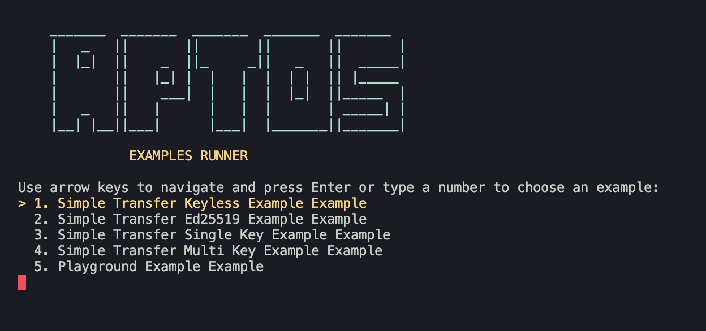

# C#/.NET SDK for Aptos (Beta)

![License][github-license]

## Overview

The Aptos .NET SDK is a library that provides a convenient way to interact with the Aptos blockchain using C# under the .NET framework. The SDK is designed to offer all the necessary tools to build applications that interact with the Aptos blockchain.

## Installation (WIP)

The SDK is pending a release on NuGet. In the meantime, you can clone the repository and build the SDK locally.

### Unity

(WIP)

### Godot

(WIP)

## Usage

Initialize an instance of the `AptosClient` class to interact with the Aptos blockchain. You can use a pre-defined network configuration from the `Networks` class.

```csharp
// 1. Import the Aptos namespace
using Aptos;

// 2. Initialize the Aptos client
var config = new AptosConfig(Networks.Mainnet);
var client = new AptosClient(config);

// 3. Use the client to interact with the blockchain!
var ledgerInfo = await client.Block.GetLedgerInfo();
```

### Sign and Submit Transactions

To sign and submit a transaction, you can build a payload using the `AptosClient` and sign it with an `Account` signer.

```csharp
using Aptos;

// 1. Initialize the Aptos client
var config = new AptosConfig(Networks.Mainnet);
var client = new AptosClient(config);

// 2. Create a new account
var account = Account.Generate();

// 2. Create a transaction payload
var transaction = await client.Transaction.Build(
    sender: account,
    data: new GenerateEntryFunctionPayloadData(
        function: "0x1::aptos_account::transfer_coins",
        typeArguments: ["0x1::aptos_coin::AptosCoin"],
        functionArguments: [account.Address, "100000"]
    )
);

// 3. Sign and submit the transaction
var pendingTransaction = client.Transaction.SignAndSubmitTransaction(account, transaction);

// 4. (Optional) Wait for the transaction to be committed
var committedTransaction = await client.Transaction.WaitForTransaction(pendingTransaction);
```

## Features

- Binary Canonical Serialization (BCS) encoding and decoding
- Ed25519, SingleKey, MultiKey, and Keyless signer support
- Utilities for transaction building, signing, and submission
- Abstractions over the Aptos Fullnode and Indexer APIs

## Examples 

Examples can be found in the [`Aptos.Examples`](./Aptos.Examples) project. Run the examples by using the following command:

```bash
dotnet run --project ./Aptos.Examples --framework net8.0
```

This will prompt the follow console. You can select an example to run by entering the corresponding number or using the arrow keys to navigate the menu.



[github-license]: https://img.shields.io/github/license/aptos-labs/aptos-ts-sdk